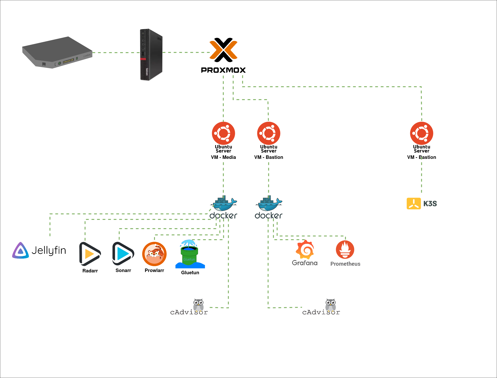

# Homelab

This repository contains the infrastructure as code (IaC) to deploy and manage a personal homelab. It uses Terraform to provision virtual machines on Proxmox and Ansible to configure the services and applications.

## Repository Structure

```
.
├── ansible/
│   ├── roles/
│   │   ├── arr-stack/
│   │   ├── base-storage/
│   │   ├── gluetun/
│   │   ├── homepage/
│   │   ├── install-docker/
│   │   ├── k3s-setup/
│   │   └── monitoring/
│   ├── inventory/
│   ├── playbooks/
│   └── ...
├── kubernetes/
│   ├── MIGRATION-PLAN.md
│   └── PROGRESS.md
├── proxmox/
│   └── README-Proxmox.md
└── terraform/
    ├── environments/
    │   ├── prod/
    │   └── test/
    └── modules/
        └── proxmox-vm-ubuntu-24-cloudinit/
```

-   `ansible/`: Contains Ansible playbooks and roles for configuration management.
    -   `roles/`: Each role is responsible for a specific service (e.g., `arr-stack`, `monitoring`). See the README in each role's directory for more details.
-   `kubernetes/`: K3s manifests and migration documentation for the Docker → K3s migration.
-   `terraform/`: Contains Terraform configurations for infrastructure provisioning.
    -   `modules/`: Reusable Terraform modules (e.g., for creating a Proxmox VM).
    -   `environments/`: Environment-specific configurations (e.g., `prod`, `test`).
-   `proxmox/`: Documentation related to Proxmox setup and VM templates.

## Getting Started

This guide will help you to deploy the entire homelab infrastructure and services from scratch.

### 1. Prerequisites

-   A Proxmox server up and running.
-   A Cloud-Init template configured on Proxmox. See the [Proxmox README](./proxmox/README-Proxmox.md) for instructions.

### 2. Infrastructure Deployment

Use Terraform to create the virtual machines, networks, and storage. See the [Terraform README](./terraform/README.md) for detailed instructions on how to set up the provider and deploy the infrastructure.

### 3. Configuration Management

Use Ansible to configure the services and applications on the provisioned VMs. See the [Ansible README](./ansible/README.md) for instructions on how to run the playbooks.

#### Docker VMs

```bash
ansible-playbook ./ansible/playbooks/site.yml --ask-vault-pass
```

#### K3s Cluster

Deploys K3s, hardens the node (SSH, UFW, fail2ban), installs [Tailscale](https://tailscale.com/) mesh VPN, and installs Helm:

```bash
ansible-playbook ./ansible/playbooks/k3s.yml
```

After the playbook completes, SSH into the K3s node and authenticate Tailscale:

```bash
sudo tailscale up
```

Then approve the device in your [Tailscale admin console](https://login.tailscale.com/admin/machines).

## Hardware Specifications (Mini PC)

- **CPU:** Intel® Core™ i7-7700T (4 Cores, 8 Threads)
- **RAM:** 16GB DDR4 (Upgradable to 32GB)
- **Storage:** 256GB NVMe SSD (Internal) + 300GB USB HDD (External)
- **Network:** 1Gbps LAN + Tailscale Mesh VPN

## Resource Allocation Strategy (16GB RAM Limit)

To keep the system stable on 16GB of RAM, we use the following allocation:
- **Proxmox OS:** ~1GB overhead
- **Bastion VM (100):** 1GB (Docker + Jump box)
- **Media VM (101):** 4GB (Arr Stack + Jellyfin)
- **K3s Node (102):** 4GB (K8s Workloads)
- **OpenClaw VM (103):** 2GB (Dedicated AI VM)
- **Buffer:** 4GB (Free for Proxmox caching/bursts)

## Services

### Dedicated VM (Ansible)
- **OpenClaw**: AI assistant running natively on Ubuntu 24.04 (VM 103).

### Docker (Ansible - Migrating soon)
- **Arr stack**: Radarr, Sonarr, Prowlarr, qBittorrent, Jellyseerr, Jellyfin.
- **Monitoring**: Prometheus, Grafana.
- **Homepage**: Dashboard.

### K3s (Kubernetes - Target)
- **Homepage**: First app to be migrated (Manual YAML).
- **Monitoring**: Prometheus/Grafana (Helm).
- **Alerting**: Uptime Kuma + Alertmanager (Phase 6).
- **Media**: Arr stack (Complex YAML/Sidecars).

> 📋 See the [Migration Plan](./kubernetes/MIGRATION-PLAN.md) and [Progress Tracker](./kubernetes/PROGRESS.md) for the Docker → K3s migration status.

For more details on each service, see the corresponding Ansible role's README.

### ARR Stack Configuration

- Configure arr applications through UI (The configuration as code is not yet implemented)
    - Go to homelab page: `http://<bastion-server-ip>:3000`
    - From there you have access to all the applications (Jellyfin, Radarr, Sonarr, etc)
    - Configure each application (Jellyfin, Radarr, Sonarr, etc), here is some useful links to help you with the initial configuration:
        - [arr stack](https://yams.media/config/)