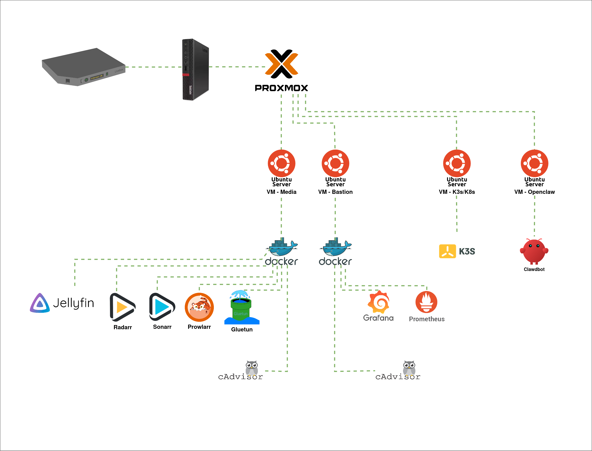

# Homelab

This repository contains the infrastructure as code (IaC) to deploy and manage a personal homelab. It uses Terraform to provision virtual machines on Proxmox and Ansible to configure the services and applications.

## Repository Structure

```
.
├── ansible/
│   ├── roles/
│   │   ├── arr-stack/
│   │   ├── base-storage/
│   │   ├── gluetun/
│   │   ├── homepage/
│   │   ├── install-docker/
│   │   └── monitoring/
│   ├── inventory/
│   ├── playbooks/
│   └── ...
├── kubernetes/
├── proxmox/
│   └── README-Proxmox.md
└── terraform/
    ├── environments/
    │   ├── prod/
    │   └── test/
    └── modules/
        └── proxmox-vm-ubuntu-24-cloudinit/
```

-   `ansible/`: Contains Ansible playbooks and roles for configuration management.
    -   `roles/`: Each role is responsible for a specific service (e.g., `arr-stack`, `monitoring`). See the README in each role's directory for more details.
-   `kubernetes/`: K3s manifests and migration documentation for the Docker → K3s migration.
-   `terraform/`: Contains Terraform configurations for infrastructure provisioning.
    -   `modules/`: Reusable Terraform modules (e.g., for creating a Proxmox VM).
    -   `environments/`: Environment-specific configurations (e.g., `prod`, `test`).
-   `proxmox/`: Documentation related to Proxmox setup and VM templates.

## Getting Started

This guide will help you to deploy the entire homelab infrastructure and services from scratch.

### 1. Prerequisites

-   A Proxmox server up and running.
-   A Cloud-Init template configured on Proxmox. See the [Proxmox README](./proxmox/README-Proxmox.md) for instructions.

### 2. Infrastructure Deployment

Use Terraform to create the virtual machines, networks, and storage. See the [Terraform README](./terraform/README.md) for detailed instructions on how to set up the provider and deploy the infrastructure.

### 3. Configuration Management

Use Ansible to configure the services and applications on the provisioned VMs. See the [Ansible README](./ansible/README.md) for instructions on how to run the playbooks.

#### Docker VMs

```bash
ansible-playbook ./ansible/playbooks/site.yml --ask-vault-pass
```

#### K3s Cluster

Deploys a single-node K3s cluster using the `k3s.orchestration` collection. (Hardening, Tailscale, and Helm installation are currently planned but not yet implemented in the playbook):

```bash
ansible-playbook ./ansible/playbooks/k3s.yml
```

#### K3s Media Storage (Manual, one-time)

The 500GB USB disk is attached to VM 102 in Proxmox and mounted manually. After attaching the disk in Proxmox UI, SSH into VM 102 and run:

```bash
# Identify the disk (should appear as /dev/sdb)
lsblk

# Check filesystem and UUID
sudo blkid /dev/sdb

# Check filesystem integrity (required before any resize)
sudo e2fsck -f /dev/sdb

# If you resized the disk in Proxmox, expand the filesystem to fill the new space
sudo resize2fs /dev/sdb

# Create mount point and mount
sudo mkdir -p /opt/data
sudo mount /dev/sdb /opt/data

# Persist via fstab using UUID (device names can change, UUIDs don't)
echo "UUID=<uuid-from-blkid> /opt/data ext4 defaults,nofail 0 2" | sudo tee -a /etc/fstab

# Verify
df -h /opt/data
ls /opt/data/media
```

> **Note:** `nofail` in fstab is critical — without it, VM 102 will fail to boot if the USB disk is disconnected. The current disk UUID is `1efc2198-9007-404e-8bc7-a4b0f4f0138b`.
>
> After mounting, apply the K8s PV and all arr manifests: `kubectl apply -f kubernetes/arr/`
>
> Add hostnames to your local `/etc/hosts` pointing to `192.168.1.162`: `qbittorrent.my.network`, `prowlarr.my.network`, `radarr.my.network`, `sonarr.my.network`, `jellyfin.my.network`, `jellyseerr.my.network`.

#### OpenClaw VM

Deploys the [OpenClaw](https://github.com/openclaw/openclaw) AI assistant on a dedicated Ubuntu 24.04 VM using the [openclaw-ansible](https://github.com/openclaw/openclaw-ansible) collection:

```bash
ansible-playbook ./ansible/playbooks/openclaw.yml
```

After the playbook completes, SSH into the **OpenClaw VM** and authenticate Tailscale:

```bash
sudo tailscale up
```

Then, run the onboarding to finish the setup and install the daemon:

```bash
sudo su - openclaw
openclaw onboard --install-daemon
```

## Hardware Specifications (Mini PC)

- **CPU:** Intel® Core™ i7-7700T (4 Cores, 8 Threads)
- **RAM:** 16GB DDR4 (Upgradable to 32GB)
- **Storage:** 256GB NVMe SSD (Internal) + 500GB USB HDD (External, attached to K3s VM 102)
- **Network:** 1Gbps LAN + Tailscale Mesh VPN

## Resource Allocation Strategy (16GB RAM Limit)

To keep the system stable on 16GB of RAM, we use the following allocation:
- **Proxmox OS:** ~1GB overhead
- **Bastion VM (100):** 1GB (Docker + Jump box)
- **K3s Node (102):** 4GB (K8s Workloads — Arr stack, Homepage)
- **OpenClaw VM (103):** 2GB (Dedicated AI VM)
- **Buffer:** 8GB (Free for Proxmox caching/bursts — VM 101 decommissioned)

## Services

### Dedicated VM (Ansible)
- **OpenClaw**: AI assistant running natively on Ubuntu 24.04 (VM 103).

### Docker (Ansible - Legacy, decommissioning in progress)
- **Arr stack**: Radarr, Sonarr, Prowlarr, qBittorrent, Jellyseerr, Jellyfin. *(being replaced by K3s)*
- **Monitoring**: Prometheus, Grafana. *(being replaced by K3s)*
- **Homepage**: Dashboard. *(migrated to K3s)*

### K3s (Kubernetes - Target)
- **Homepage**: Dashboard.
- **Monitoring**: Prometheus/Grafana (Helm).
- **Alerting**: Uptime Kuma + Alertmanager.
- **Media**: Arr stack.

For more details on each service, see the corresponding Ansible role's README.

### ARR Stack Configuration

- Configure arr applications through UI (The configuration as code is not yet implemented)
    - Go to homelab page: `http://<bastion-server-ip>:3000`
    - From there you have access to all the applications (Jellyfin, Radarr, Sonarr, etc)
    - Configure each application (Jellyfin, Radarr, Sonarr, etc), here is some useful links to help you with the initial configuration:
        - [arr stack](https://yams.media/config/)